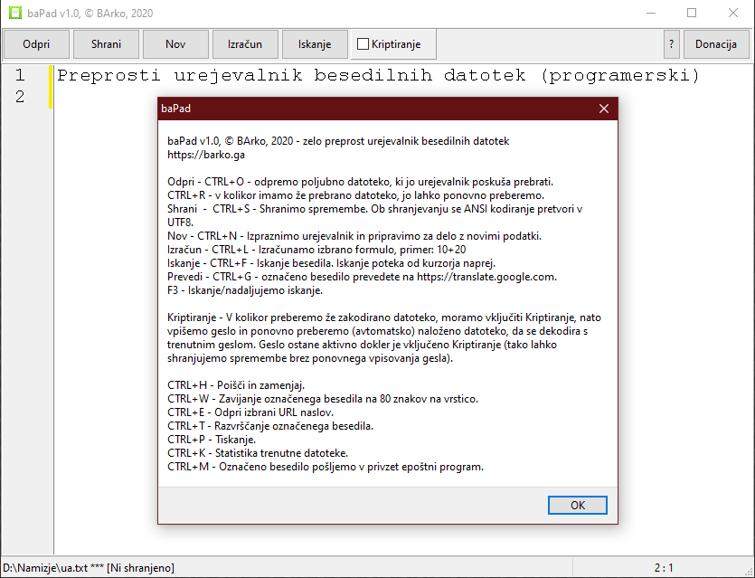

baPad - zelo preprost urejevalnik besedilnih datotek z različnimi dodatki:

      - možnost odpiranja resnično velikih datotek
      - preračunavanje različnih formul, ki jih označimo in s kombinacijo tipk
        izračunamo
      - kriptiranje z geslom
      - pošiljanje označenega besedila na google prevajalnk
      - pošiljanje označenega besedila v epoštni program
      - hitro iskanje in zamenjava besedila
      - hitro označevanje enakih besed
      - zavijanje označenega besesedila na dolžini 80 znakov
      - razvrščanje označenega besedila od a do ž
      - iskanje označenega besedila preko duckduckgo
      - sprememba v označenem besedilu iz malih v velike črke in obratno
      - tiskanje
      - statistika besedila (vseh znakov, vseh vrstic, vseh znakov brez
        presledkov)
      - odpiranje označenega url naslova (začenši s http ali https)
      - odpiranje in prepoznava vseh kodnih tabel, ki jih prepozna freepascal
      - izključno shranjevanje v UTF8
      - CTRL + povleci in spusti mapo v urejevalnik generira spisek vsebine mape

Izvršne datoteke za zagon na Win32, Win64 in Lin64 se nahajajo v bin mapi.

Aplikacija je odprtokodna. Za prevajanje potrebujete (CodeTyphon Studio Ver 7) https://www.pilotlogic.com/sitejoom/index.php/downloads/category/14-codetyphon.html

